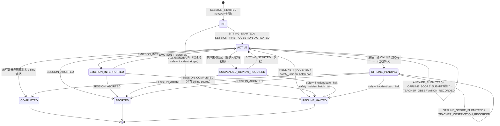

# 05 状态机与事件规范

版本：v1.0.0-draft  
工程基线：schema v0.1.10-scoring-closure | PRD v1.0.9-job-skill-assessment-mvp-closure  
事件规范基线：xc-career-guide-event-payload-schema-v1.0.0  
最后更新：2026-07-07

---

## 1. assessment_session 三阶段状态机

### 1.1 三阶段复用方案

PRD v1.0.9 明确：**复用现有 `assessment_session`，不新增第二套 session 表**（决策 72）。一个 session 实例通过 `assessment_session_question.question_phase` 三值（ONLINE / OFFLINE / OBSERVATION）覆盖全部阶段：

| 阶段 | question_phase | 计分 | 完成率分母 | 记录表 |
|---|---|---|---|---|
| 线上答题 | ONLINE | 0/2 | 计入 online_question_count | answer_record |
| 线下评分 | OFFLINE | 0/1/2 | 计入 offline_question_count | offline_score_record |
| 教师观察 | OBSERVATION | 不计分（score=NULL） | 不计入 | offline_score_record（scope=TEACHER_OBSERVATION） |

### 1.2 sitting_no 递增规则

- `sitting_no` 在 `domain_event_projection` 表中记录（v0.1.10 已有字段）。
- 同一 session 内，每次 `SITTING_STARTED` 事件递增 sitting_no（从 1 开始）。
- 坐次跨越多日场景：第一天做完 ONLINE，第二天教师做 OFFLINE 评分，第三天补录 OBSERVATION——每次重新开始评估活动都开新坐次。
- sitting_no 用于事件回放时的坐次级聚合查询，不影响状态机主路径。

### 1.3 完整状态流转图



### 1.4 状态分类

| 分类 | 状态 | 说明 |
|---|---|---|
| 开放态 | INIT | session 已创建、组卷完成、学生尚未开始 |
| 开放态 | ACTIVE | 学生正在答题或教师正在评分/观察 |
| 开放态 | EMOTION_INTERRUPTED | 学生情绪中断，等待恢复 |
| 开放态 | SUSPENDED_REVIEW_REQUIRED | 坐次间歇或待复核，可回 ACTIVE |
| 开放态 | OFFLINE_PENDING | 线上已完成，等待线下评分/观察 |
| 终态 | COMPLETED | 所有计分题评分完毕 |
| 终态 | ABORTED | 人工中止 |
| 终态 | REDLINE_HALTED | 安全红线触发，不可恢复 |

### 1.5 三阶段 session 生命周期（典型路径）

```text
TEACHER 创建 session（SESSION_STARTED → status=ACTIVE）
  ↓
SITTING_STARTED（sitting_no=1，线上阶段）
  ↓
学生答 18 道线上题（ANSWER_SUBMITTED × 18）
  ↓
最后一道 ONLINE 提交 → status=OFFLINE_PENDING
  ↓
SITTING_ENDED（sitting_no=1）
  ↓
SITTING_STARTED（sitting_no=2，线下阶段）
  ↓
教师评 6 道线下题（OFFLINE_SCORE_SUBMITTED × 6）
  ↓
教师录入观察（TEACHER_OBSERVATION_RECORDED × 0-3）
  ↓
SESSION_COMPLETED → status=COMPLETED
  ↓
RESULT_CALCULATED → result_record（JOB_SKILL_SCORE）
  ↓
REPORT_GENERATED → task_report（report_scope=JOB_SKILL）
```

---

## 2. v1.0.9 新增事件类型

### 2.1 与现有 event-payload-schema-v1.0.0 的关系

**增补方式：向后兼容新增事件类型**，不发布新版本。理由：

1. JSONL 信封格式不变（`ActionLogEntry` 结构不变）。
2. `schema_version` 保持 1（新事件只增加可选字段或新类型，不改已有 payload 结构）。
3. `EventType` union 类型扩展（新增成员是向后兼容变更）。
4. `domain_event_projection.event_type` 是自由文本（无 CHECK），无需 migration。
5. 未知 event_type 的 reducer 已有 `default: break` 兜底（向前兼容）。

建议在 event-payload-schema 文档末尾追加"v1.0.0-patch-1"修订说明，而非升级版本号。

### 2.2 新增 EventType 枚举成员

```typescript
// 追加到 EventType union（event-payload-schema §1）
type EventType =
  // ... 现有 29 个事件类型保持不变 ...
  | 'TEACHER_OBSERVATION_RECORDED'       // v1.0.8 定义，v1.0.9 payload 修订
  | 'JOB_SKILL_RESULT_GENERATED'         // 专业岗位结果生成（可复用 RESULT_CALCULATED + strategy_type 判别）
```

[!] PRD v1.0.9 §8.7 说"JOB_SKILL_ASSESSMENT_STARTED / COMPLETED 可复用现有 SESSION_STARTED / SESSION_COMPLETED + strategy_type 判别，二选一"。**建议复用现有事件**（SESSION_STARTED payload 已含 strategy_type 字段），不新增专用事件类型，减少 reducer 分支和事件目录膨胀。

[!] PRD v1.0.9 §8.7 同样说"JOB_SKILL_RESULT_GENERATED"可独立或复用 RESULT_CALCULATED。**建议复用 RESULT_CALCULATED**（payload 已含 result_type 字段可区分 JOB_SKILL_SCORE），除非需要携带完全不同的 payload 结构。

### 2.3 TEACHER_OBSERVATION_RECORDED

#### 触发条件

- session 处于 ACTIVE 或 OFFLINE_PENDING 状态
- `assessment_session_question` 中存在 phase=OBSERVATION 且 item_usage=OBSERVATION_ONLY 的题目
- 教师完成嵌入观察编码录入

#### 前置状态 → 后置状态

| 前置状态 | 后置状态 | 说明 |
|---|---|---|
| ACTIVE | ACTIVE | 观察不改变 session 状态 |
| OFFLINE_PENDING | OFFLINE_PENDING | 观察不改变 session 状态 |

#### Payload Schema

```typescript
interface TeacherObservationRecordedPayload {
  session_id: string;
  offline_score_id: string;              // offline_score_record.offline_score_id
  question_id: string;                   // 观察项 question_bank.question_id
  bank_domain: 'JOB_SPECIFIC';
  interaction_type: 'TEACHER_OBSERVATION';
  observation_payload: TeacherObservationPayload; // teacher-observation-v1.0 结构
  recorded_by: string;                   // 教师 user_id
  recorded_at: string;                   // ISO 8601 UTC
}

interface TeacherObservationPayload {
  schema_version: 'teacher-observation-v1.0';
  observation_code: string;              // 观察编码（如 ACCIDENT_RESPONSE）
  observed: boolean;                     // 是否观察到目标行为
  behavior_codes: string[];              // 编码维度白名单内的行为编码
  prompt_level: 'P0' | 'P1' | 'P2' | 'P3' | null;
  accommodations_used: string[];
  observation_note: string | null;
  post_disclosure_status?: 'NOT_REQUIRED' | 'PENDING' | 'COMPLETED';
  recorded_by: string;
  recorded_at: string;
}
```

#### Reducer 投影动作

1. INSERT `offline_score_record`：score_scope='TEACHER_OBSERVATION'，score=NULL，observation_payload_json=JSON.stringify(observation_payload)。
2. 不更新 `assessment_session.status`（观察不是状态变更事件）。
3. 只更新 `assessment_session.last_applied_event_id`。

#### 幂等策略

INSERT 类：`offline_score_id` 存在则 skip。

---

### 2.4 SITTING_STARTED

#### 触发条件

- session 处于 INIT / ACTIVE / SUSPENDED_REVIEW_REQUIRED / OFFLINE_PENDING 状态
- 教师发起一次新的坐次（面对面评估活动开始）

#### 前置状态 → 后置状态

| 前置状态 | 后置状态 | 说明 |
|---|---|---|
| INIT | ACTIVE | 首次坐次开始，session 激活 |
| SUSPENDED_REVIEW_REQUIRED | ACTIVE | 恢复坐次 |
| ACTIVE | ACTIVE | 连续坐次（不改变状态，仅记录） |
| OFFLINE_PENDING | OFFLINE_PENDING | 线下评分坐次开始（不改变状态） |

[!] PRD 对 SITTING_STARTED 是否驱动 INIT→ACTIVE 转换未做明确声明。当前实现中 SESSION_STARTED 直达 ACTIVE（reducer 注释：无独立 SESSION_ACTIVATED 事件）。建议：SITTING_STARTED 在 INIT 状态时**也**触发 ACTIVE 转换作为备选路径（向后兼容当前 SESSION_STARTED 直达 ACTIVE 的行为）。

#### Payload Schema

```typescript
interface SittingStartedPayload {
  session_id: string;
  sitting_no: number;                    // 递增坐次号（1-based）
  started_at: string;                    // ISO 8601 UTC
  started_by: string;                    // 教师 user_id
}
```

#### Reducer 投影动作

1. 如果 session.status = INIT → UPDATE status='ACTIVE'，last_status_event_id=event_id。
2. 如果 session.status = SUSPENDED_REVIEW_REQUIRED → UPDATE status='ACTIVE'，last_status_event_id=event_id。
3. 其他开放态 → 仅更新 last_applied_event_id。
4. 终态 → no-op（不应到达此处，handler 前置校验拦截）。

#### 幂等策略

UPDATE 类：last_status_event_id == event_id 则 skip。

---

### 2.5 SITTING_ENDED

#### 触发条件

- session 处于 ACTIVE 或 OFFLINE_PENDING
- 教师结束当前坐次（计划暂停 / 正常完成 / 崩溃结束）

#### 前置状态 → 后置状态

| 前置状态 | 后置状态（按 end_reason） | 说明 |
|---|---|---|
| ACTIVE + COMPLETED_NORMALLY | SUSPENDED_REVIEW_REQUIRED | 当天坐次结束，下次再来 |
| ACTIVE + PAUSED_BY_PLAN | SUSPENDED_REVIEW_REQUIRED | 计划分坐次暂停 |
| ACTIVE + ENDED_BY_COLLAPSE | EMOTION_INTERRUPTED | 情绪崩溃结束坐次 |
| OFFLINE_PENDING + COMPLETED_NORMALLY | OFFLINE_PENDING | 保持等待线下评分 |
| OFFLINE_PENDING + PAUSED_BY_PLAN | SUSPENDED_REVIEW_REQUIRED | 线下评分中途暂停 |

[!] SITTING_ENDED 的 end_reason→后置状态映射在 PRD 中未完全定义。上表为根据业务语义的推断，需确认。特别是 OFFLINE_PENDING + PAUSED_BY_PLAN 是否应转 SUSPENDED_REVIEW_REQUIRED（线下评分只做到一半）。

#### Payload Schema

```typescript
interface SittingEndedPayload {
  session_id: string;
  sitting_no: number;
  ended_at: string;                      // ISO 8601 UTC
  ended_by: string;                      // 教师 user_id
  end_reason: 'COMPLETED_NORMALLY' | 'PAUSED_BY_PLAN' | 'ENDED_BY_COLLAPSE';
  current_question_order?: number | null; // 结束时进度指针
}
```

#### Reducer 投影动作

按 end_reason 分支更新 session.status + pause 相关字段。

#### 幂等策略

UPDATE 类：last_status_event_id == event_id 则 skip。

---

### 2.6 EMOTION_COLLAPSE_RECORDED

#### 触发条件

- session 处于 ACTIVE 状态
- 坐次内发生一次情绪崩溃（非单次可恢复中断，而是确认未恢复的崩溃）

#### 前置状态 → 后置状态

| 前置状态 | 后置状态 |
|---|---|
| ACTIVE | ACTIVE（仅记录，不改变状态） |

#### Payload Schema

```typescript
interface EmotionCollapseRecordedPayload {
  session_id: string;
  sitting_no: number;
  recorded_at: string;                   // ISO 8601 UTC
  current_question_order?: number | null;
}
```

#### Reducer 投影动作

纯记录事件，不更新 assessment_session 状态或字段。event 写入 domain_event_projection 后，由 handler 层累计计数判断是否达到 emotion_collapse_threshold 并决定是否发 EMOTION_COLLAPSE_THRESHOLD_REACHED。

#### 幂等策略

无投影副作用，天然幂等。

---

### 2.7 JOB_SKILL_RESULT_GENERATED（建议复用 RESULT_CALCULATED）

如决定复用 RESULT_CALCULATED，则无需新增事件类型。RESULT_CALCULATED payload 已有 `result_type` 字段，取值 `JOB_SKILL_SCORE` 即可区分。

如决定独立事件，payload 定义如下：

```typescript
interface JobSkillResultGeneratedPayload {
  result_id: string;
  result_type: 'JOB_SKILL_SCORE';
  source_type: 'ASSESSMENT_SESSION';
  source_id: string;                     // session_id
  student_id: string;
  job_code: string;
  task_code: string;
  raw_score: number;                     // /48
  max_score: 48;
  normalized_score: number;              // raw/48*100
  completion_ratio: number;              // 计分题完成比
  observation_completion_ratio: number;  // 观察项完成比
  level_result: 'LEVEL_COMPETENT' | 'LEVEL_CONDITIONAL' | 'LEVEL_NOT_COMPETENT' | 'LEVEL_FAIL_BY_SAFETY';
  job_module_profiles: Record<string, JobModuleProfile>;
  recommended_training_focus: string[];
  calculated_at: string;
  calculated_by: string;
}

interface JobModuleProfile {
  online_raw: number;
  online_max: number;
  offline_raw: number;
  offline_max: number;
  score_rate: number;
}
```

**推荐方案**：复用 RESULT_CALCULATED，在 `breakdown` 字段（现已用于 ABILITY_SCORE 的 module_profiles）中携带 job_module_profiles 等数据，存入 result_payload_json。这样 reducer `applyResultCalculated` 无需修改。

---

## 3. 触发器变更建议

### 3.1 无需修改的触发器

以下触发器对新 strategy_type 自动生效，无需改写逻辑：

| 触发器 | 理由 |
|---|---|
| trg_assessment_session_no_terminal_status_change | 仅检查终态列表，与 strategy_type 无关 |
| trg_assessment_session_redline_requires_fail_by_safety | 同上 |
| trg_assessment_session_explicit_redline_paths | 检查开放态列表，JOB_SKILL session 仍走相同开放态 |
| trg_assessment_session_block_unresolved_safety_incident | 按 student_id + task_code 过滤，无 strategy_type 条件 |
| trg_assessment_session_strategy_config_match_insert/update | 联表 strategy_config 四列校验，JOB_SKILL_ASSESSMENT 自然通过 |
| trg_safety_incident_bind_open_assessments | 按 student_id + task_code + 开放态过滤 |
| trg_result_record_insert_safety_override_guard | 检查 safety_overridden 一致性 |

### 3.2 需要修改的触发器

#### 3.2.1 strategy_config.strategy_type CHECK

```sql
-- 现状
CHECK (strategy_type IN ('BASELINE_ASSESSMENT', 'MOCK_EXAM', 'TRAINING_PRACTICE'))
-- 目标
CHECK (strategy_type IN ('BASELINE_ASSESSMENT', 'MOCK_EXAM', 'TRAINING_PRACTICE', 'JOB_SKILL_ASSESSMENT'))
```

#### 3.2.2 assessment_session.strategy_type CHECK

```sql
-- 现状
CHECK (strategy_type IN ('BASELINE_ASSESSMENT', 'MOCK_EXAM'))
-- 目标
CHECK (strategy_type IN ('BASELINE_ASSESSMENT', 'MOCK_EXAM', 'JOB_SKILL_ASSESSMENT'))
```

#### 3.2.3 assessment_session_question.question_phase CHECK

```sql
-- 现状
CHECK (question_phase IN ('ONLINE', 'OFFLINE'))
-- 目标
CHECK (question_phase IN ('ONLINE', 'OFFLINE', 'OBSERVATION'))
```

#### 3.2.4 assessment_session_question 新增列与约束

```sql
-- 新增列
bank_domain      TEXT NOT NULL CHECK (bank_domain IN ('BASE_ABILITY', 'JOB_SPECIFIC'))
job_module_code  TEXT CHECK (job_module_code IS NULL OR job_module_code IN ('M1','M2','M3','M4','M5','M6'))
item_usage       TEXT NOT NULL CHECK (item_usage IN ('SCORED_ITEM', 'OBSERVATION_ONLY'))

-- module_type 改为可空
module_type TEXT CHECK (module_type IS NULL OR module_type IN (...))

-- 域配对 CHECK
CHECK (
  (bank_domain = 'BASE_ABILITY' AND module_type IS NOT NULL AND job_module_code IS NULL)
  OR (bank_domain = 'JOB_SPECIFIC' AND module_type IS NULL AND job_module_code IS NOT NULL)
)
CHECK (
  (item_usage = 'OBSERVATION_ONLY' AND question_phase = 'OBSERVATION')
  OR (item_usage = 'SCORED_ITEM' AND question_phase IN ('ONLINE', 'OFFLINE'))
)
```

#### 3.2.5 offline_score_record.score_scope CHECK

```sql
-- 现状
CHECK (score_scope IN ('OFFLINE_ABILITY', 'TASK_OPERATION'))
-- 目标
CHECK (score_scope IN ('OFFLINE_ABILITY', 'JOB_SKILL', 'TASK_OPERATION', 'TEACHER_OBSERVATION'))
```

#### 3.2.6 offline_score_record.score 可空

```sql
-- 现状
score INTEGER NOT NULL CHECK (score IN (0, 1, 2))
-- 目标
score INTEGER CHECK (score IS NULL OR score IN (0, 1, 2))
```

新增约束：TEACHER_OBSERVATION scope 下 score 必须 NULL；其他 scope 下 ANSWERED 状态 score NOT NULL。

#### 3.2.7 offline_score_record 新增列

```sql
observation_payload_json TEXT,
response_status TEXT NOT NULL DEFAULT 'ANSWERED'
```

#### 3.2.8 result_record.result_type CHECK

```sql
-- 现状
CHECK (result_type IN ('ABILITY_SCORE', 'TRAINING_COMPLETION', 'OPERATION_PASS_RATE'))
-- 目标
CHECK (result_type IN ('ABILITY_SCORE', 'TRAINING_COMPLETION', 'OPERATION_PASS_RATE', 'JOB_SKILL_SCORE'))
```

#### 3.2.9 result_record.strategy_type CHECK

```sql
-- 现状
CHECK (strategy_type IS NULL OR strategy_type IN ('BASELINE_ASSESSMENT', 'MOCK_EXAM', 'TRAINING_PRACTICE'))
-- 目标
CHECK (strategy_type IS NULL OR strategy_type IN ('BASELINE_ASSESSMENT', 'MOCK_EXAM', 'TRAINING_PRACTICE', 'JOB_SKILL_ASSESSMENT'))
```

#### 3.2.10 result_record source_aggregate_type CHECK 扩展

```sql
-- 现状
CHECK (
  (result_type IN ('ABILITY_SCORE', 'OPERATION_PASS_RATE') AND source_aggregate_type = 'ASSESSMENT_SESSION')
  OR (result_type = 'TRAINING_COMPLETION' AND source_aggregate_type = 'TRAINING_SESSION')
)
-- 目标
CHECK (
  (result_type IN ('ABILITY_SCORE', 'OPERATION_PASS_RATE', 'JOB_SKILL_SCORE') AND source_aggregate_type = 'ASSESSMENT_SESSION')
  OR (result_type = 'TRAINING_COMPLETION' AND source_aggregate_type = 'TRAINING_SESSION')
)
```

### 3.3 新增触发器建议

#### 3.3.1 OBSERVATION phase 不得写入 answer_record

```sql
CREATE TRIGGER IF NOT EXISTS trg_answer_record_no_observation_phase
BEFORE INSERT ON answer_record
FOR EACH ROW
WHEN EXISTS (
  SELECT 1 FROM assessment_session_question sq
  WHERE sq.session_id = NEW.session_id
    AND sq.question_id = NEW.question_id
    AND sq.question_phase = 'OBSERVATION'
)
BEGIN
  SELECT RAISE(ABORT, 'OBSERVATION phase questions cannot have answer_record');
END;
```

#### 3.3.2 TEACHER_OBSERVATION scope 强制 score=NULL

```sql
CREATE TRIGGER IF NOT EXISTS trg_offline_score_observation_null_score
BEFORE INSERT ON offline_score_record
FOR EACH ROW
WHEN NEW.score_scope = 'TEACHER_OBSERVATION' AND NEW.score IS NOT NULL
BEGIN
  SELECT RAISE(ABORT, 'TEACHER_OBSERVATION score must be NULL');
END;
```

#### 3.3.3 策略-题库域绑定（组卷校验）

```sql
-- 确保 JOB_SKILL_ASSESSMENT session 只选 JOB_SPECIFIC 题
CREATE TRIGGER IF NOT EXISTS trg_session_question_bank_domain_match_insert
BEFORE INSERT ON assessment_session_question
FOR EACH ROW
WHEN EXISTS (
  SELECT 1 FROM assessment_session s
  WHERE s.session_id = NEW.session_id
    AND s.strategy_type = 'JOB_SKILL_ASSESSMENT'
    AND NEW.bank_domain <> 'JOB_SPECIFIC'
)
BEGIN
  SELECT RAISE(ABORT, 'JOB_SKILL_ASSESSMENT session can only select JOB_SPECIFIC questions');
END;

-- 确保 BASELINE_ASSESSMENT/MOCK_EXAM 只选 BASE_ABILITY 题
CREATE TRIGGER IF NOT EXISTS trg_session_question_base_domain_match_insert
BEFORE INSERT ON assessment_session_question
FOR EACH ROW
WHEN EXISTS (
  SELECT 1 FROM assessment_session s
  WHERE s.session_id = NEW.session_id
    AND s.strategy_type IN ('BASELINE_ASSESSMENT', 'MOCK_EXAM')
    AND NEW.bank_domain <> 'BASE_ABILITY'
)
BEGIN
  SELECT RAISE(ABORT, 'BASELINE_ASSESSMENT/MOCK_EXAM session can only select BASE_ABILITY questions');
END;
```

---

## 4. Reducer 变更清单

### 4.1 assessment-reducer.ts 修改

| 事件 | 变更类型 | 说明 |
|---|---|---|
| SESSION_STARTED | 修改 | 新增 bank_domain / job_module_code / item_usage 写入 assessment_session_question；question_phase 需支持 OBSERVATION |
| TEACHER_OBSERVATION_RECORDED | 新增 | INSERT offline_score_record（scope=TEACHER_OBSERVATION） |
| SITTING_STARTED | 新增 | 条件性更新 status（INIT/SUSPENDED→ACTIVE） |
| SITTING_ENDED | 新增 | 按 end_reason 更新 status |
| EMOTION_COLLAPSE_RECORDED | 新增 | no-op（仅记录到 projection） |
| OFFLINE_SCORE_SUBMITTED | 修改 | 支持 JOB_SKILL scope；支持 score=NULL（TEACHER_OBSERVATION 不应走此事件） |
| ANSWER_SUBMITTED | 修改 | 最后一道线上题后转 OFFLINE_PENDING 的判断需考虑 JOB_SKILL 策略（offline_question_count=6 而非 8） |

### 4.2 applySessionStarted 修改要点

```typescript
// 现状：只写 question_phase / module_type / question_type
// 目标：加写 bank_domain / job_module_code / item_usage
// question_phase 判定逻辑变更：
//   - 现状：i < online_question_count ? 'ONLINE' : 'OFFLINE'
//   - 目标：从 question_bank 读取 item_usage 和 question_type 推断：
//           item_usage='OBSERVATION_ONLY' → 'OBSERVATION'
//           question_type='OFFLINE_OPERATION' → 'OFFLINE'
//           其余 → 'ONLINE'
```

### 4.3 新事件 TypeScript 类型导入

在 `src/shared/types/event-payloads.ts` 中新增：

```typescript
export interface TeacherObservationRecordedPayload {
  session_id: string;
  offline_score_id: string;
  question_id: string;
  bank_domain: 'JOB_SPECIFIC';
  interaction_type: 'TEACHER_OBSERVATION';
  observation_payload: TeacherObservationPayload;
  recorded_by: string;
  recorded_at: string;
}

export interface SittingStartedPayload {
  session_id: string;
  sitting_no: number;
  started_at: string;
  started_by: string;
}

export interface SittingEndedPayload {
  session_id: string;
  sitting_no: number;
  ended_at: string;
  ended_by: string;
  end_reason: 'COMPLETED_NORMALLY' | 'PAUSED_BY_PLAN' | 'ENDED_BY_COLLAPSE';
  current_question_order?: number | null;
}

export interface EmotionCollapseRecordedPayload {
  session_id: string;
  sitting_no: number;
  recorded_at: string;
  current_question_order?: number | null;
}
```

---

## 5. 事件聚合根映射（增补）

| 事件类型 | aggregate_type | aggregate_id 来源 |
|---|---|---|
| TEACHER_OBSERVATION_RECORDED | ASSESSMENT_SESSION | session_id |
| JOB_SKILL_RESULT_GENERATED（或复用 RESULT_CALCULATED） | ASSESSMENT_SESSION | session_id |

SITTING_STARTED / SITTING_ENDED / EMOTION_COLLAPSE_RECORDED 已在 event-payload-schema-v1.0.0 §附录 A 中定义。

---

## 6. 发现的冲突与遗漏

### [!] PRD v1.0.8 → v1.0.9 payload 不一致

v1.0.8 §8.7.4 定义 TEACHER_OBSERVATION_RECORDED payload 含 `post_disclosure_done: boolean`（必填）。v1.0.9 §5.4.5.3 修订为 `post_disclosure_status?: PostDisclosureStatus`（可选枚举）。**以 v1.0.9 为准**。event-payload-schema 文档中该事件尚未存在，直接按 v1.0.9 定义新增即可。

### [!] SITTING_STARTED 与 SESSION_STARTED 的 INIT→ACTIVE 竞争

当前 reducer `applySessionStarted` 直接将 session 置为 ACTIVE（绕过 INIT），注释说明"无独立 SESSION_ACTIVATED 事件"。如果 SITTING_STARTED 也要驱动 INIT→ACTIVE，则：
- 方案 A（推荐）：保持 SESSION_STARTED 直达 ACTIVE，SITTING_STARTED 在 ACTIVE 态为 no-op（仅记录坐次）。
- 方案 B：SESSION_STARTED 改为 INIT，SITTING_STARTED 驱动 INIT→ACTIVE。但这破坏现有行为和冷启动重放。

**建议采用方案 A**。INIT 仅在"session 已组卷但 SESSION_STARTED 尚未应用"的中间态出现（如应用崩溃后恢复），不暴露给业务流。

### [!] OFFLINE_PENDING → COMPLETED 的转换触发者未明确

当前 reducer 中，最后一道 ONLINE 题提交后**自动**从 ACTIVE→OFFLINE_PENDING。但 OFFLINE_PENDING→COMPLETED 的转换由谁触发？现状是需要显式 SESSION_COMPLETED 事件（由 handler 在检测到所有 offline scored 后发出）。JOB_SKILL 场景新增了 TEACHER_OBSERVATION，需确认：
- 观察项全部录入是否作为 SESSION_COMPLETED 的前置条件？
- PRD v1.0.9 决策 75 说"观察项不进入计分 completion_ratio"，暗示观察缺失不阻止 session 完成。
- **建议**：SESSION_COMPLETED 前置条件仅检查 SCORED_ITEM 的 offline 题全部已评分；observation_completion_ratio 作为结果质量指标而非 session 完成门禁。

### [!] assessment_session 缺少 sitting_no 字段

`domain_event_projection` 有 sitting_no 字段，但 `assessment_session` 表本身没有 current_sitting_no 列。如需在 session 查询时快速获取当前坐次号，可能需要新增字段或从 event_projection 聚合查询。PRD 未明确要求 session 表新增该字段。**建议**：不加列，从 event_projection 按 aggregate_id 查 MAX(sitting_no) 即可。

---

## 7. EventType 完整枚举（v0.1.12 目标）

```typescript
type EventType =
  // Assessment Session（15）
  | 'SESSION_STARTED'
  | 'SESSION_FIRST_QUESTION_ACTIVATED'
  | 'ANSWER_SUBMITTED'
  | 'EMOTION_INTERRUPTED'
  | 'EMOTION_RESUMED'
  | 'SITTING_STARTED'
  | 'SITTING_ENDED'
  | 'EMOTION_COLLAPSE_RECORDED'
  | 'EMOTION_COLLAPSE_THRESHOLD_REACHED'
  | 'OFFLINE_SCORE_SUBMITTED'
  | 'TEACHER_OBSERVATION_RECORDED'       // v1.0.9 新增
  | 'REDLINE_TRIGGERED'
  | 'SESSION_COMPLETED'
  | 'SESSION_ABORTED'
  // Training Session（6）
  | 'TRAINING_STARTED'
  | 'TRAINING_STEP_STARTED'
  | 'TRAINING_STEP_COMPLETED'
  | 'TRAINING_STEP_SKIPPED'
  | 'TRAINING_STEP_FAILED'
  | 'TRAINING_COMPLETED'
  // Result & Report（5）
  | 'RESULT_CALCULATED'
  | 'REPORT_GENERATED'
  | 'REPORT_EXPORTED'
  | 'REPORT_LOCKED'
  | 'PLACEMENT_REVIEW_CONFIRMED'
  // Question Bank（1）
  | 'QUESTION_SUPERSEDED'
  // Safety Incident（5）
  | 'SAFETY_INCIDENT_CREATED'
  | 'SAFETY_INCIDENT_DETAIL_CONFIRMED'
  | 'SAFETY_INCIDENT_RESOLVED'
  | 'SAFETY_INCIDENT_VOIDED'
  | 'SAFETY_INCIDENT_REPLACED_FOR_FACTUAL_CORRECTION'
  // System（3）
  | 'SNAPSHOT_COMMITTED'
  | 'RECOVERY_REPLAYED'
  | 'RECOVERY_LOG_TRUNCATED';
```

共 35 个事件类型（现有 29 + 新增 TEACHER_OBSERVATION_RECORDED；SITTING_STARTED / SITTING_ENDED / EMOTION_COLLAPSE_RECORDED / PLACEMENT_REVIEW_CONFIRMED / QUESTION_SUPERSEDED 在 v1.0.6 event-payload-schema 已定义但 reducer 尚未实现）。
